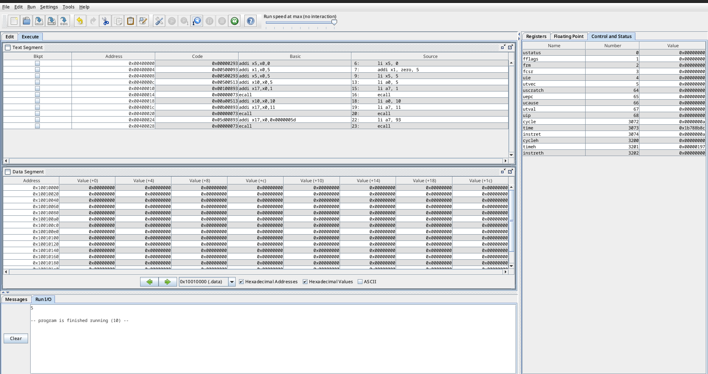
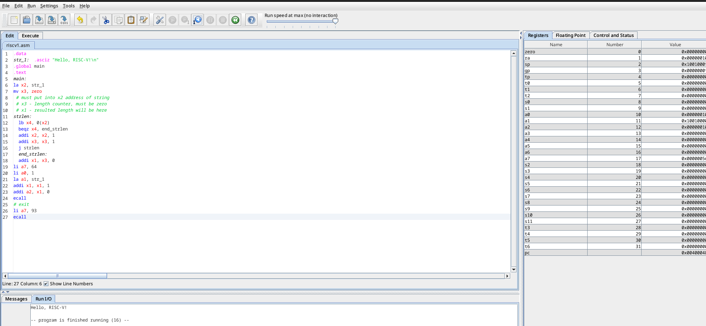

Выполнение 
Исходный код </br>
https://github.com/danil228-emelin/compiler-final-project/tree/main </br>
Описание языка MiniLang </br>

MiniLang - это простой императивный язык программирования, разработанный для обучения основам программирования и компиляции. Язык сочетает минималистичный синтаксис с базовыми конструкциями программирования.
Основные характеристики

    Простой синтаксис с минимальным количеством ключевых слов

    Статическая типизация с двумя базовыми типами

    Базовые управляющие конструкции (условия, циклы)

    Поддержка ввода/вывода

    Арифметические и логические операции

Синтаксис и конструкции языка
1. Объявление переменных
   minilang
```
var x, y: int
var name: string
```
    Поддерживаются два типа:

        int - целые числа

        string - строки

    Можно объявлять несколько переменных через запятую

2. Присваивание значений
   minilang
```
x = 10
name = "Hello"
y = x + 5 * 2
```
3. Условные конструкции
   minilang
```
if x > 0 then {
print "Positive"
} else {
print "Non-positive"
}
```
4. Циклы
   minilang
```
while x < 10 {
print x
x = x + 1
}
```

5. Ввод/вывод
   minilang
```
print "Result is: "
print x
```
6. Арифметические операции

Поддерживаются стандартные операции:

    +, -, *, /

    >, <, >=, <=, ==, !=

    &&, ||, !

Компиляция

Программы на MiniLang компилируются в:

    RISC-V ассемблерный код

    AST-дерево для визуализации структуры программы

Структура проекта

main/ </br>
├── ASTPrinter.java </br>
├── BackendPart.java</br>
├── Compiler.java</br>
├── GrammarMinilangBaseVisitor.java</br>
├── GrammarMinilang.interp</br>
├── GrammarMinilangLexer.interp</br>
├── GrammarMinilangLexer.java</br>
├── GrammarMinilangLexer.tokens</br>
├── GrammarMinilangParser.java</br>
├── GrammarMinilang.tokens</br>
├── GrammarMinilangVisitor.java</br>
└── program.minilang</br>

1. **Compiler.java** - главный класс компилятора. Содержит точку входа (main), которая:

- Читает исходный файл (program.minilang) или стандартный ввод

- Запускает лексер и парсер

- Обрабатывает ошибки

- Запускает BackendPart для генерации кода

- Выводит сгенерированный RISC-V код

2. **BackendPart.java** - реализация visitor, который обходит AST и генерирует RISC-V код. Наследуется от `GrammarMinilangBaseVisitor`. Содержит методы:

- `visitProg` - обработка всей программы

- `visitAssignSt` - присваивание

- `visitWhileStat` - цикл while

- `visitIfStatement` - условие if

- и другие методы для обработки выражений, объявлений переменных и т.д.

3. **GrammarMinilangBaseVisitor.java** - сгенерированный ANTLR4 базовый visitor.

4. **GrammarMinilangLexer.java** - сгенерированный лексер.

5. **GrammarMinilangParser.java** - сгенерированный парсер.

6. **GrammarMinilangVisitor.java** - сгенерированный интерфейс visitor.

7. **GrammarMinilang.tokens, GrammarMinilangLexer.tokens, GrammarMinilang.interp, GrammarMinilangLexer.interp** - вспомогательные файлы, сгенерированные ANTLR4.

8. **ASTPrinter.java** - утилита для печати AST.

9. **program.minilang** - пример программы на языке MiniLang.

rules/ </br>
├── CommonLexerRules.g4 </br>
├── Don_work </br>
├── generator.sh </br>
└── GrammarMinilang.g4 </br>


1. **CommonLexerRules.g4**:

- Этот файл содержит общие правила лексера, которые могут использоваться в нескольких грамматиках.


2. **generator.sh**:

- скрипт для генерации парсера и лексера из файлов грамматики (.g4) с помощью ANTLR.

3. **GrammarMinilang.g4**:

- Основной файл грамматики для языка MiniLang.

- Определяет структуру языка: объявления переменных, операторы, выражения, управляющие конструкции и т.д.

**Генерация кода**

1. Скомпилировать все java-файлы:

```

javac -cp antlr-4.13.1-complete.jar: main/*.java

```

2. Запустить компилятор на примере программы:

```

java -cp antlr-4.13.1-complete.jar: main.Compiler program.minilang

```

## Пример program.minilang:

```minilang

:> program on minilang language
var x: int

x = 5

print x

```

## Генерация кода:

Компилятор генерирует RISC-V ассемблерный код. Например, для приведенной программы:

 
```
Abstract Syntax Tree (AST):
Prog [
  Declaration [
    Variable_decl_id [
      TERMINAL: var
      TERMINAL: x
      TERMINAL: :
      Type_basic [
        TERMINAL: int
      ]
    ]
    TERMINAL: 

  ]
  Assign [
    AssignSt [
      Left_expr [
        TERMINAL: x
      ]
      TERMINAL: =
      Value [
        TERMINAL: 5
      ]
    ]
    TERMINAL: 

  ]
  PrintSmth [
    PrintExpr [
      TERMINAL: print
      Id [
        TERMINAL: x
      ]
      TERMINAL: 

    ]
  ]
]
```

```asm

.data
.global main
.text
main:
      # declare x into x5 register
      li x5, 0
      addi x1, zero, 5
      # save value 5 of variable x into x5 register
      li x5, 5
      # take value 5 from register x5(store x)
      # print expression result
      # load integer value into a0
      li a0, 5
      # prepare syscall for printing integer
      li a7, 1
      ecall
      # print newline
      li a0, 10
      li a7, 11
      ecall
      # exit
      li a7, 93
      ecall
```




## Пример program.minilang (работа со строками)
```minilang

:> program on minilang language
:> this is comment
print "Hello, RISC-V!\n"

```

## Генерация кода:
````

Abstract Syntax Tree (AST):
Prog [
  PrintSmth [
    PrintString [
      TERMINAL: print
      TERMINAL: "Hello, RISC-V!\n"
      TERMINAL: 

    ]
  ]
]

.data
str_1:  .asciz "Hello, RISC-V!\n" 
.global main
.text
main:
la x2, str_1
mv x3, zero
 # must put into x2 address of string
 # x3 - length counter, must be zero
 # x1 - resulted length will be here
strlen:
  lb x4, 0(x2)
  beqz x4, end_strlen
  addi x2, x2, 1
  addi x3, x3, 1
  j strlen
  end_strlen:
  addi x1, x3, 0
li a7, 64
li a0, 1
la a1, str_1
addi x1, x1, 1
addi a2, x1, 0
ecall
# exit
li a7, 93
ecall
